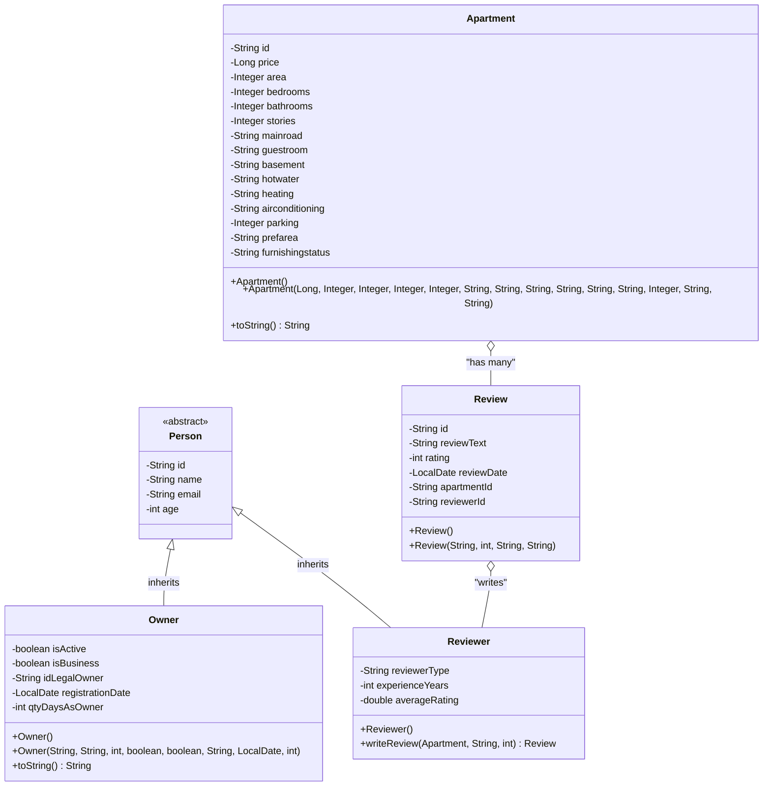

```mermaid
classDiagram
    class Person {
        <<abstract>>
        -String id
        -String name
        -String email
        -int age
    }

    class Owner {
        -boolean isActive
        -boolean isBusiness
        -String idLegalOwner
        -LocalDate registrationDate
        -int qtyDaysAsOwner
        +Owner()
        +Owner(String, String, int, boolean, boolean, String, LocalDate, int)
        +toString() String
    }

    class Reviewer {
        -String reviewerType
        -int experienceYears
        -double averageRating
        +Reviewer()
        +writeReview(Apartment, String, int) Review
    }

    class Apartment {
        -String id
        -Long price
        -Integer area
        -Integer bedrooms
        -Integer bathrooms
        -Integer stories
        -String mainroad
        -String guestroom
        -String basement
        -String hotwater
        -String heating
        -String airconditioning
        -Integer parking
        -String prefarea
        -String furnishingstatus
        +Apartment()
        +Apartment(Long, Integer, Integer, Integer, Integer, String, String, String, String, String, String, Integer, String, String)
        +toString() String
    }

    class Review {
        -String id
        -String reviewText
        -int rating
        -LocalDate reviewDate
        -String apartmentId
        -String reviewerId
        +Review()
        +Review(String, int, String, String)
    }

    Person <|-- Owner : inherits
    Person <|-- Reviewer : inherits
    Apartment o-- Review : "has many"
    Review   o-- Reviewer : "writes"
```
